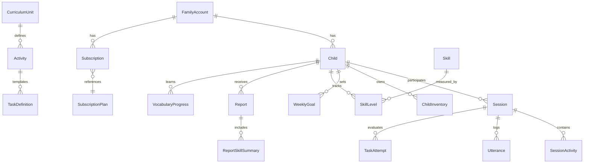

# MyVoice (밤토리) — Development Specification v2.0

> **이 문서는 다중 AI 모델 협업 개발의 "단일 진실 소스(Single Source of Truth)"입니다.**
> 모든 코딩 작업은 이 SPEC을 기준으로 수행하고, 기획 변경은 이 문서를 먼저 업데이트합니다.

---

## 1. 협업 프로토콜 (Collaboration Protocol)

### 1.1 역할 정의

| 역할 | 모델 | 책임 |
|------|------|------|
| **Senior Architect** | Opus 4.6 | 기획 리뷰, 아키텍처 결정, 코드 리뷰, 품질 기준 설정 |
| **Developer** | Gemini | 실제 코딩, 테스트 작성, 디버깅, 구현 완료 보고 |
| **Product Owner** | 유저 (정유일) | 최종 의사결정, 우선순위 조정, 기획 방향 확정 |

### 1.2 작업 흐름 (Workflow)

```
[Product Owner] 기능 요청
       ↓
[Senior] 기획 리뷰 & SPEC 업데이트
       ↓
[Developer] SPEC 기반 구현
       ↓
[Senior] 코드 리뷰 & 피드백
       ↓
[Developer] 수정 반영
       ↓
[Product Owner] 최종 확인 → SPEC 상태 업데이트
```

### 1.3 핸드오프 규칙

1. **작업 지시 시**: 이 SPEC의 마일스톤/태스크 ID를 참조할 것 (예: "M2-T1 구현해주세요")
2. **구현 완료 시**: Developer는 변경 파일 목록, 테스트 결과, 미해결 이슈를 보고
3. **리뷰 시**: Senior는 SPEC의 Acceptance Criteria 기준으로 통과/반려 판단
4. **상태 변경**: 완료된 태스크는 `[x]`로, 진행 중은 `[/]`로, 이슈는 `[!]`로 표기

### 1.4 코드 컨벤션

- **Python**: PEP 8, type hints 필수, docstring (함수/클래스)
- **Frontend**: TypeScript, React 19, Tailwind CSS v4, shadcn/ui
- **API**: RESTful, `/v1/` prefix, snake_case (프론트엔드 연동 시 자동 camelCase 변환)
- **DB**: Alembic migration 필수, raw SQL 금지
- **테스트**: pytest (백엔드), vitest (프론트엔드), 핵심 비즈니스 로직은 unit test 필수
- **커밋**: Conventional Commits (`feat:`, `fix:`, `refactor:`, `test:`)

---

## 2. 프로젝트 아키텍처

### 2.1 기술 스택

| 계층 | 기술 | 버전 |
|------|------|------|
| **Backend** | | |
| Runtime | Python | 3.11+ |
| Framework | FastAPI | 0.128+ |
| ORM | SQLAlchemy (async) | 2.0+ |
| DB | PostgreSQL | 16 |
| Cache | Redis | 7+ |
| Migration | Alembic | 1.16+ |
| AI/ML | OpenAI API (Whisper, GPT-4o-mini, TTS) | latest |
| Auth | JWT (python-jose) + bcrypt | — |
| Email | Resend API | — |
| **Frontend** | | |
| Runtime | Node.js | 22+ |
| Framework | React | 19 |
| Build | Vite | 7+ |
| Language | TypeScript | 5.9+ |
| Styling | Tailwind CSS | v4 |
| UI Library | shadcn/ui + Radix | — |
| State | TanStack React Query | 5 |
| Animation | Framer Motion | 12 |
| Charts | Recharts | 3 |
| Routing | React Router | 7 |

### 2.2 디렉토리 구조

```
myvoice/
├── SPEC.md              ← 이 문서 (단일 진실 소스)
├── README.md
├── pyproject.toml
├── docker-compose.yml
├── docker-compose.prod.yml
├── alembic.ini
├── .env
│
├── docs/                  ← 개발 문서
│   ├── deployment_checklist.md  → 배포 전 체크리스트
│   ├── deployment_guide.md      → 배포 가이드
│   └── implementation_plan.md   → 구현 계획
│
├── wireframes/            ← UI 와이어프레임
│   ├── 01-parent-dashboard.html
│   ├── 02-report-detail.html
│   ├── 03-edit-child.html
│   └── 04-skill-deep-report.html
│
├── migrations/
│   ├── env.py
│   └── versions/
│
├── app/                   ← 백엔드 (FastAPI)
│   ├── main.py            → FastAPI entry, router mounting, CORS, ASGI middleware
│   ├── config.py          → Pydantic Settings (.env 바인딩)
│   ├── database.py        → AsyncSession, engine, Base
│   │
│   ├── models/            ← SQLAlchemy ORM (도메인 엔티티)
│   │   ├── family.py      → FamilyAccount, Child, ChildInventory
│   │   ├── subscription.py→ SubscriptionPlan, Subscription
│   │   ├── session.py     → Session, SessionActivity
│   │   ├── utterance.py   → Utterance
│   │   ├── curriculum.py  → CurriculumUnit, Activity, TaskDefinition
│   │   ├── skill.py       → Skill, SkillLevel, TaskAttempt
│   │   └── report.py      → Report, ReportSkillSummary
│   │
│   ├── schemas/           ← Pydantic request/response DTOs
│   │   ├── auth.py
│   │   ├── child.py
│   │   ├── session.py
│   │   └── report.py
│   │
│   ├── routers/           ← API endpoint groups (18 files)
│   │   ├── auth.py           → /v1/auth/* (signup, login, OAuth, email verification)
│   │   ├── auth_child.py     → /v1/auth/select-child
│   │   ├── children.py       → /v1/children/* (legacy)
│   │   ├── kid_adventures.py → /v1/kid/adventures/*
│   │   ├── kid_goals.py      → /v1/kid/goals/*
│   │   ├── kid_home.py       → /v1/kid/home, daily-bonus
│   │   ├── kid_profile.py    → /v1/kid/profile, avatar
│   │   ├── kid_sessions.py   → /v1/kid/sessions/* (음성 파이프라인)
│   │   ├── kid_shop.py       → /v1/kid/shop/*
│   │   ├── kid_skills.py     → /v1/kid/skills
│   │   ├── kid_vocabulary.py → /v1/kid/vocabulary/*
│   │   ├── parent_children.py→ /v1/parent/children/*
│   │   ├── parent_dashboard.py→ /v1/parent/dashboard/*, reports
│   │   ├── parent_insights.py→ /v1/parent/insights/* (5종 분석)
│   │   ├── reports.py        → /v1/reports/* (legacy)
│   │   ├── sessions.py       → /v1/sessions/* (legacy)
│   │   ├── trial.py          → /v1/trial/*
│   │   └── ws_voice.py       → /v1/kid/voice/{id} (WebSocket)
│   │
│   ├── services/          ← 비즈니스 로직 (14 files)
│   │   ├── speech_pipeline.py      → STT (Whisper), LLM (GPT-4o-mini), TTS
│   │   ├── session_orchestrator.py → Redis 기반 세션 상태 머신, 3-phase flow
│   │   ├── conversation_manager.py → 시스템 프롬프트 구성, 대화 히스토리
│   │   ├── curriculum_engine.py    → 다음 Activity 자동 결정
│   │   ├── evaluation_service.py   → 발화 평가 (단어수, 발음, 유창성)
│   │   ├── skill_service.py        → 스킬 레벨 스냅샷 계산
│   │   ├── report_service.py       → GPT 기반 월간 리포트 생성
│   │   ├── insights_service.py     → 키워드, 감정, 행동 패턴 분석
│   │   ├── aggregation_service.py  → 일일 활동 집계, 주간 통계
│   │   ├── gamification_service.py → XP, 레벨, 보상 계산
│   │   ├── email_service.py        → Resend API 이메일 발송
│   │   ├── openai_service.py       → OpenAI API 래퍼
│   │   ├── safety_filter.py        → 욕설/PII 필터링
│   │   └── voice_proxy.py          → Azure Realtime WebSocket 브릿지
│   │
│   └── core/              ← 공통 유틸리티
│       ├── security.py    → JWT, password, get_current_child_id
│       └── exceptions.py  → Custom HTTP exceptions
│
├── frontend/              ← 프론트엔드 (React + Vite + TypeScript)
│   ├── src/
│   │   ├── App.tsx           → 메인 라우터 (25+ 라우트)
│   │   ├── api/              → API client, hooks, types
│   │   ├── components/       → 공통 컴포넌트 (UI, layout, mission)
│   │   ├── contexts/         → AuthContext (인증 상태 관리)
│   │   ├── guards/           → ProtectedRoute (Kid/Parent)
│   │   ├── hooks/            → 음성(STT/TTS/WebSocket), pull-to-refresh
│   │   ├── lib/              → 오디오, 스킬 데이터, 유틸리티
│   │   └── pages/
│   │       ├── Landing, Login, Signup, VerifyEmail, ForgotPassword
│   │       ├── onboarding/   → Setup, ChildInfo, Subscription
│   │       ├── kid/          → Home, Adventures, Vocabulary, Shop, Profile, Skills
│   │       └── parent/       → Home, Dashboard, Insights, Reports, Settings
│   └── package.json
│
├── tests/                 ← 테스트 (50개 통과)
│   ├── conftest.py           → 테스트 인프라 (NullPool, FakeRedis, fixtures)
│   ├── test_e2e_auth.py      → 인증 E2E (8 tests)
│   ├── test_e2e_voice_session.py → 음성 세션 E2E (7 tests)
│   ├── test_e2e_parent.py    → 학부모 대시보드 E2E (10 tests)
│   ├── test_e2e_kid_features.py → 아이 기능 E2E (8 tests)
│   ├── test_phase1.py        → Phase1 유닛 테스트 (16 tests)
│   ├── test_phase3_integration.py → Phase3 통합 (1 test)
│   └── e2e/                  → Playwright 브라우저 테스트 (프론트엔드 완성 후)
│
└── scripts/               ← 유틸리티 스크립트
    └── seed_curriculum.py    → 커리큘럼 시드 데이터
```

### 2.3 데이터 플로우

```
┌─────────┐     Audio      ┌──────────┐     ┌─────────┐
│  Client  │──────────────→│  FastAPI  │────→│  Whisper │ STT
│  (React) │               │  Backend  │     │  (OpenAI)│
│          │←──────────────│           │←────│         │
└─────────┘    TTS Audio   │           │     └─────────┘
                           │           │     ┌─────────┐
                           │           │────→│ GPT-4o  │ LLM
                           │           │←────│  -mini  │
                           │           │     └─────────┘
                           │           │     ┌─────────┐
                           │           │────→│ OpenAI  │ TTS
                           │           │←────│  TTS    │
                           └──────────┘     └─────────┘
                              │    │
                         ┌────┘    └────┐
                         ▼              ▼
                    ┌──────────┐  ┌──────────┐
                    │ PostgreSQL│  │  Redis   │
                    │ (15+ tbls)│  │ (session │
                    │          │  │  + cache) │
                    └──────────┘  └──────────┘
```

---

## 3. 도메인 모델 요약

### 3.1 엔티티 관계 (ER)



### 3.2 핵심 필드 (구현 완료)

> 모든 도메인 모델은 `app/models/` 에 구현됨.
> 15+ 테이블이 Alembic 마이그레이션으로 PostgreSQL에 생성 완료.

---

## 4. API 계약 (Contract)

### 4.1 인증 (Auth) — `/v1/auth/*`

| Method | Endpoint | 설명 | Auth |
|--------|----------|------|------|
| POST | `/v1/auth/signup` | 이메일 회원가입 + 인증 메일 발송 | — |
| POST | `/v1/auth/login` | 이메일/비밀번호 로그인 | — |
| POST | `/v1/auth/login/mock` | 개발용 목 로그인 | — |
| GET | `/v1/auth/verify-email` | 이메일 인증 콜백 | — |
| POST | `/v1/auth/resend-verification` | 인증 메일 재발송 | — |
| POST | `/v1/auth/forgot-password` | 비밀번호 재설정 메일 | — |
| POST | `/v1/auth/reset-password` | 비밀번호 재설정 | — |
| GET | `/v1/auth/google` | Google OAuth 리디렉트 | — |
| GET | `/v1/auth/google/callback` | Google OAuth 콜백 | — |
| GET | `/v1/auth/kakao` | Kakao OAuth 리디렉트 | — |
| GET | `/v1/auth/kakao/callback` | Kakao OAuth 콜백 | — |
| GET | `/v1/auth/apple` | Apple Sign In 리디렉트 | — |
| POST | `/v1/auth/apple/callback` | Apple Sign In 콜백 | — |
| POST | `/v1/auth/select-child` | 자녀 선택 → child_token 발급 | Bearer family_token |

### 4.2 Kids View — `/v1/kid/*`

| Method | Endpoint | 설명 | Auth |
|--------|----------|------|------|
| GET | `/v1/kid/home` | 홈 대시보드 (프로필, 목표, 모험, 스트릭) | child_token |
| POST | `/v1/kid/home/daily-bonus` | 일일 보너스 수령 | child_token |
| GET | `/v1/kid/profile` | 프로필 상세 (레벨, XP, 아바타) | child_token |
| PATCH | `/v1/kid/profile/avatar` | 아바타 변경 | child_token |
| GET | `/v1/kid/adventures` | 모험 목록 (커리큘럼 유닛) | child_token |
| GET | `/v1/kid/adventures/{id}` | 모험 상세 | child_token |
| POST | `/v1/kid/adventures/{id}/complete` | 모험 완료 + 보상 | child_token |
| POST | `/v1/kid/sessions` | 세션 시작 (curriculum / free_talk) | child_token |
| POST | `/v1/kid/sessions/{id}/utterances` | 발화 업로드 → STT → LLM → TTS | child_token |
| POST | `/v1/kid/sessions/{id}/tts` | TTS 생성 | child_token |
| POST | `/v1/kid/sessions/{id}/end` | 세션 종료 + XP 부여 | child_token |
| WS | `/v1/kid/voice/{id}` | WebSocket 실시간 음성 | child_token |
| GET | `/v1/kid/vocabulary` | 어휘 카테고리 목록 | child_token |
| GET | `/v1/kid/vocabulary/{id}/words` | 카테고리 단어 목록 | child_token |
| POST | `/v1/kid/vocabulary/{id}/complete` | 카테고리 완료 + 보상 | child_token |
| GET | `/v1/kid/shop` | 상점 아이템 + 인벤토리 | child_token |
| POST | `/v1/kid/shop/purchase` | 아이템 구매 (스타 소비) | child_token |
| GET | `/v1/kid/skills` | 스킬 레벨 목록 | child_token |
| GET | `/v1/kid/goals` | 주간 목표 조회/생성 | child_token |
| POST | `/v1/kid/goals` | 주간 목표 수정 | child_token |

### 4.3 Parent View — `/v1/parent/*`

| Method | Endpoint | 설명 | Auth |
|--------|----------|------|------|
| POST | `/v1/parent/children` | 자녀 등록 | family_token |
| GET | `/v1/parent/children` | 자녀 목록 | family_token |
| GET | `/v1/parent/children/{id}` | 자녀 상세 | family_token |
| PATCH | `/v1/parent/children/{id}` | 자녀 정보 수정 | family_token |
| GET | `/v1/parent/dashboard/stats` | 주간 학습 통계 | family_token |
| GET | `/v1/parent/reports` | 리포트 목록 | family_token |
| GET | `/v1/parent/reports/{id}` | 리포트 상세 | family_token |
| POST | `/v1/parent/reports/generate` | 리포트 수동 생성 | family_token |
| GET | `/v1/parent/insights/keywords` | 키워드 분석 | family_token |
| GET | `/v1/parent/insights/sentiment` | 감정 분석 | family_token |
| GET | `/v1/parent/insights/timeline` | 활동 타임라인 | family_token |
| GET | `/v1/parent/insights/language-mix` | 한/영 비율 | family_token |
| GET | `/v1/parent/insights/behavior` | 행동 패턴 | family_token |

### 4.4 체험 (Trial) — `/v1/trial/*`

| Method | Endpoint | 설명 | Auth |
|--------|----------|------|------|
| POST | `/v1/trial/quick-start` | 원핸드 온보딩 (device_id → temp token) | — |

---

## 5. 세션 플로우 상세 (핵심 비즈니스 로직)

### 5.1 세션 상태 머신

```
[IDLE] ──start──→ [ACTIVE] ──pause──→ [PAUSED]
                      │                    │
                      ▼                    ▼
                  [ENDED] ←──resume── [PAUSED]
                      ▲
                      │
               [ACTIVE] ──timeout──→ [ENDED]
```

상태는 Redis `session:{id}:state` 키에 저장.

### 5.2 나레이터-주인공 전환 구조 (3-Phase Flow)

> FDD 3.1.7.1에서 정의됨. 모든 커리큘럼 세션은 이 구조를 따른다.

```
Phase 1: NARRATOR_INTRO (Listen Mode)
├── 화자: Narrator (따뜻한 성우 목소리)
├── 화면: 시네마틱 3인칭 관점
├── 상태: 마이크 Off, 터치 Off
└── 내용: 세계관 설정, 이전 줄거리 요약

          ↓ (나레이션 종료)

Phase 2: TRANSITION (Trigger Wait)
├── 화자: Popo 또는 Narrator
├── 대사: "자, 이제 네 차례야! Go!"
└── 상태: 마이크 On, 트리거 단어 대기

          ↓ (아이가 "Go!" 등 트리거 발화)

Phase 3: INTERACTIVE (Conversation Loop)
├── 화자: Luna (영어) + Popo (한국어/보조)
├── 루프: STT → Signal → LLM → TTS → 반복
└── 상태: 양방향 대화 진행
```

### 5.3 대화 루프 (Phase 3 상세)

```
1. Client → Audio Upload (child 발화)
2. Backend:
   a. STT 호출 → text_raw, stt_confidence
   b. Utterance(child) 생성
   c. 빈 텍스트/소음 → Fallback 메시지 (LLM 호출 안 함)
   d. 안전 필터링 (욕설/위험 표현 체크)
3. SessionActivity + TaskDefinition 조회
4. LLM 프롬프트 구성:
   - Activity.instructions_for_ai
   - 직전 대화 맥락
   - Child 스킬 레벨 요약
5. LLM 응답 → Safety Check → 최종 텍스트
6. Utterance(ai) 생성
7. TTS 호출 → 오디오 → 클라이언트
8. Background: 발화 평가 (단어수, 발음, 유창성) → TaskAttempt
```

### 5.4 캐릭터 & 언어 정책

| 캐릭터 | 정체성 | 언어 | TTS Voice | 역할 |
|--------|--------|------|-----------|------|
| **Luna** | 우주에서 온 아이 | 영어 only | nova | 학습 타겟 언어 노출, 친구 같은 친밀감 |
| **Popo** | 정부 파견 비밀 요원 | 한국어+영어 | shimmer | 코치, 안전장치, 정서적 공감 |
| **Narrator** | 동화책 화자 | 한국어 | onyx | 스토리 도입부 몰입감 조성 |

### 5.5 사용자 뷰 분리 (Dual-View Architecture)

> 아이와 부모는 **완전히 다른 기능**에 접근한다. 하나의 앱 내에서 프로필 전환(PIN 잠금)으로 뷰를 분리한다.

#### Kids View — 주인공의 모험 (12 pages)

| 페이지 | 설명 |
|--------|------|
| KidHome | Popo와 자유 대화, 일일 통계, 보너스 |
| Adventures | 모험 목록, 난이도 필터, 보상 표시 |
| AdventureDetail | 모험 상세, 활동 목록, 보상 정보 |
| AdventurePlay | 실시간 음성 대화 (WebSocket), 타이머 |
| AdventureResult | 완료 결과, XP/레벨업 |
| Vocabulary | 어휘 카테고리, 진행도 |
| VocabularyLearning | 단어 학습 (한/영 번역) |
| VocabularyResult | 학습 결과 |
| KidShop | 스타로 아이템 구매 |
| KidProfile | 프로필, 아바타, 레벨, 스트릭 |
| KidSkills | 스킬 분석 (차트: 바, 라인, 레이더) |

**Kids UI 원칙:**
- 모든 터치 대상 ≥ 60x60pt (4~7세 소근육 발달 고려)
- 아이콘/아바타 중심 — 텍스트 최소화
- 파스텔/중채도 컬러, 부드러운 애니메이션 (Calm Tech)
- 리포트, 설정, 결제 등 일체 노출하지 않음

#### Parent View — 헬퍼의 대시보드 (7 pages)

| 페이지 | 설명 |
|--------|------|
| ParentHome | 자녀 카드, 최근 활동, 빠른 접근 |
| LearningDashboard | 학습 시간, 세션 수, 일별 차트 |
| ConversationInsights | 키워드, 감정, 행동, 언어 비율, 타임라인 |
| RecommendationsSettings | 학습 추천, 설정 |
| Dashboard | 상세 분석, 리포트 |
| ReportDetail | 월간 리포트 상세 |
| EditChild | 자녀 프로필 편집 |

**Parent UI 원칙:**
- **10초 규칙** — 핵심 변화를 카드 형태로 즉시 파악
- 다크 모드 완벽 지원 (취침 전 확인 시나리오)
- PIN/생체인증으로 Kids View와 잠금 분리

---

## 6. 게이미피케이션 시스템

### 6.1 재화 & 보상

| 재화 | 획득 방법 | 사용처 |
|------|----------|--------|
| XP | 세션 완료 (분x10 + 턴x5 + 완료보너스 50) | 레벨업 |
| Stars | 모험 완료, 어휘 완료, 일일 보너스 | 상점 구매 |
| Hearts | 일일 보너스, 상점 구매 | 시도 횟수 |

### 6.2 레벨 시스템

- Level = 1 + (total_xp / 100)
- 레벨업 시 알림 + 애니메이션

### 6.3 상점 아이템

| 아이템 | 가격 (Stars) | 효과 |
|--------|-------------|------|
| Hint | 10 | 힌트 1회 |
| Time Extension | 15 | 시간 연장 |
| Heart Refill | 20 | 하트 충전 |

### 6.4 일일 보너스 & 스트릭

- 매일 1회 보너스 수령 가능 (Stars + Hearts)
- 연속 출석 시 스트릭 카운트 증가

---

## 7. 마일스톤 & 태스크 (Implementation Roadmap)

> 각 태스크는 `M{n}-T{n}` ID로 참조합니다.

### M1. 도메인 스키마 & 기본 API ✅ DONE

- [x] **M1-T1**: PostgreSQL 스키마 생성 (15+ tables, Alembic migration)
- [x] **M1-T2**: FastAPI 프로젝트 스캐폴드 (main, config, database)
- [x] **M1-T3**: Auth API (signup, login, JWT, email verification)
- [x] **M1-T4**: Children CRUD API
- [x] **M1-T5**: Sessions API (start, utterance, end)
- [x] **M1-T6**: Reports API (list, detail)
- [x] **M1-T7**: Trial API (quick-start)
- [x] **M1-T8**: API 네임스페이스 리팩터링 (`/v1/kid/*`, `/v1/parent/*`)
- [x] **M1-T9**: Auth 확장 (select-child, OAuth, email verification)
- [x] **M1-T10**: Child 모델 확장 (pin_hash, avatar_id, inventory)

---

### M2. 세션 + 음성 파이프라인 ✅ DONE

- [x] **M2-T1**: Speech Pipeline — STT (OpenAI Whisper)
- [x] **M2-T2**: Speech Pipeline — LLM 대화 생성 (GPT-4o-mini, JSON mode)
- [x] **M2-T3**: Speech Pipeline — TTS (OpenAI TTS, Redis 캐싱)
- [x] **M2-T4**: Session Orchestrator — Redis 상태 머신 + 3-Phase Flow
- [x] **M2-T5**: Utterance 라우터 — 전체 파이프라인 연결
- [x] **M2-T6**: Silence/Timeout 처리 (reprompt + auto-pause)
- [x] **M2-T7**: Conversation Manager — 시스템 프롬프트 구성
- [x] **M2-T8**: WebSocket 실시간 음성 (Azure Realtime + HTTP fallback)
- [x] **M2-T9**: Safety Filter (욕설/PII 필터링)
- [x] **M2-T10**: Idempotency Key 지원

---

### M3. 평가 + 스킬 시스템 ✅ DONE

- [x] **M3-T1**: Curriculum Engine (다음 Activity 자동 결정)
- [x] **M3-T2**: Evaluation Service (발화 평가: 단어수, 발음, 유창성)
- [x] **M3-T3**: Skill Service (스킬 레벨 스냅샷 계산, 5단계)
- [x] **M3-T4**: Gamification Service (XP, 레벨, 보상)

---

### M4. 학부모 대시보드 + 리포트 ✅ DONE

- [x] **M4-T1**: Report Service (GPT 기반 월간 리포트 생성)
- [x] **M4-T2**: Reports API (목록, 상세, 수동 생성)
- [x] **M4-T3**: Aggregation Service (일일 활동, 주간 통계)
- [x] **M4-T4**: Insights API 5종 (keywords, sentiment, timeline, language-mix, behavior)
- [x] **M4-T5**: Dashboard Stats API

---

### M5. 프론트엔드 ✅ DONE

- [x] **M5-T1**: 프로젝트 셋업 (React 19 + Vite 7 + TypeScript + Tailwind v4)
- [x] **M5-T2**: 인증 페이지 (Login, Signup, VerifyEmail, ForgotPassword)
- [x] **M5-T3**: 온보딩 플로우 (Setup, ChildInfo, Subscription)
- [x] **M5-T4**: Kids View 전체 (12 pages)
- [x] **M5-T5**: Parent View 전체 (7 pages)
- [x] **M5-T6**: 음성 인터랙션 (WebSocket, Browser STT/TTS, Audio recorder/player)
- [x] **M5-T7**: API hooks + 상태 관리 (React Query)
- [x] **M5-T8**: 게이미피케이션 UI (레벨, XP, 스타, 하트, 스트릭, 일일보너스)

---

### M6. 테스트 + 품질 ✅ DONE (partial)

- [x] **M6-T1**: E2E 통합 테스트 (50개 통과)
- [x] **M6-T2**: ASGI 미들웨어 전환 (BaseHTTPMiddleware → pure ASGI)
- [x] **M6-T3**: 테스트 인프라 (NullPool, FakeRedis, 세션 스코프 이벤트 루프)
- [ ] **M6-T4**: 프론트엔드-백엔드 통합 테스트
- [ ] **M6-T5**: Playwright 브라우저 E2E 테스트

---

### M7. 배포 + 운영 🔲 TODO

- [ ] **M7-T1**: 커리큘럼 시드 데이터 (W1~W4)
- [ ] **M7-T2**: 프로덕션 Docker 빌드 + 배포
- [ ] **M7-T3**: 도메인 + SSL + DNS 설정
- [ ] **M7-T4**: CI/CD 파이프라인
- [ ] **M7-T5**: 구조화 로깅 (JSON)
- [ ] **M7-T6**: 모니터링 대시보드

---

## 8. 기술 결정 사항 (ADR Log)

| # | 결정 | 이유 | 날짜 |
|---|------|------|------|
| 1 | Python 3.11 | union syntax, 성능 향상, 장기 지원 | 2026-02-14 |
| 2 | Docker Desktop (PostgreSQL + Redis) | 환경 일관성, 팀 공유 용이 | 2026-02-14 |
| 3 | 단일 FastAPI 앱 (monolith) | MVP 단계 복잡도 최소화 | 2026-02-14 |
| 4 | OpenAI 전 파이프라인 (STT+LLM+TTS) | 통합 API 키, 단일 벤더 | 2026-02-14 |
| 5 | React 19 + Vite 7 + Tailwind v4 | 최신 스택, 빠른 HMR | 2026-03 |
| 6 | shadcn/ui + Radix | 접근성, 커스터마이징 자유도 | 2026-03 |
| 7 | TanStack React Query | 서버 상태 관리, 캐싱 최적화 | 2026-03 |
| 8 | NullPool + pure ASGI middleware | asyncpg 이벤트 루프 호환성 | 2026-03 |
| 9 | Resend API (email) | 간편한 설정, 개발자 친화적 | 2026-03 |

---

## 9. 핵심 성공 지표 (KPIs)

| 지표 | 목표 | 측정 방법 |
|------|------|-----------|
| 세션당 평균 발화 수 | ≥ 15회 | `Utterance(speaker_type=child)` 집계 |
| D7 Retention | ≥ 30% | 첫 세션 후 7일 내 재방문율 |
| 월간 리포트 열람률 | ≥ 60% | Report 생성 대비 delivered_at 비율 |
| TTFA (Time To First Audio) | ≤ 2초 | STT+LLM+TTS 왕복 시간 |
| 세션당 비용 | ~$0.21 | STT+LLM+TTS 합산 |

---

## 10. 참조 문서

| 문서 | 위치 | 용도 |
|------|------|------|
| 배포 체크리스트 | `docs/deployment_checklist.md` | 배포 전 확인 항목 |
| 배포 가이드 | `docs/deployment_guide.md` | 배포 절차 |
| FDD MVP v1.4 | `project-x/밤토리/fdd/FDD_MVP_v1.4.md` | 전체 기능 설계서 |
| 온톨로지 정의서 v0.1.1 | `project-x/밤토리/fdd/` | 도메인 모델 원본 |
| Skill Dictionary | `project-x/밤토리/fdd/Skill_Dictionary_v0.1.md` | 스킬 분류 체계 |
| 와이어프레임 | `wireframes/` | 학부모 뷰 UI 설계 (4 pages + Visily) |

---

> **문서 버전**: v2.0 | **최종 수정**: 2026-03-20 | **작성**: Opus 4.6 + 정유일
