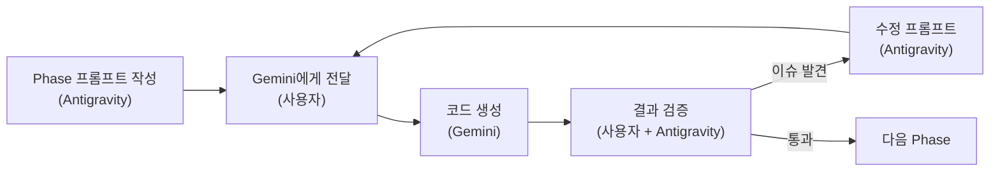

# Crystal 프로토타입 기반 개발 계획 (확정)

> **최종 업데이트**: 2026-03-06
> **현재 상태**: Phase 1~3 완료, Phase 4A(Voice AI) 프롬프트 작성 완료

## 확정된 결정 사항

| # | 결정 | 확정 내용 |
|---|------|---------|
| 1 | 전략 | **Option B** — Crystal React 프론트엔드 추출 + FastAPI 백엔드 연동 |
| 2 | 프론트엔드 위치 | **`myvoice/frontend/`** 에 통합 |
| 3 | 용어 | "미션" → **"모험/세션"** (주인공 모드) |
| 4 | 개발 방식 | **Gemini를 통한 코딩**, 각 Phase별 프롬프트 제공 |

---

## 1. 분석 요약

### Crystal 프로토타입 vs 우리 아키텍처

| 영역 | Crystal 프로토타입 | 우리 백엔드 (myvoice) |
|------|------------------|---------------------|
| **Frontend** | React 19 + Vite 7 + TailwindCSS 4 | ❌ 미구축 |
| **Backend** | Express + tRPC + Drizzle (MySQL) | FastAPI + SQLAlchemy (PostgreSQL) |
| **Auth** | Manus OAuth (단일 사용자) | Google/Apple OAuth + family/child 토큰 |
| **DB** | MySQL (12 flat tables) | PostgreSQL (family-based model) |
| **음성** | Web Speech API (브라우저 내장) | Whisper + GPT-4 (서버사이드 AI) |
| **아키텍처** | 단일 뷰 (사용자 1명) | 듀얼 뷰 (Kids View / Parent View) |

### Crystal UI 스크린샷 요약

````carousel
.png)
<!-- slide -->

<!-- slide -->

<!-- slide -->

<!-- slide -->

<!-- slide -->

<!-- slide -->

<!-- slide -->

````

---

## 2. Gemini 협업 워크플로우

각 Phase를 Gemini에게 프롬프트로 전달하여 코딩을 수행합니다.



### 프롬프트 구성 원칙

Gemini에게 전달하는 프롬프트는 다음 구조를 따릅니다:

1. **프로젝트 컨텍스트** — 현재 프로젝트 상태, 디렉토리 구조, 기술 스택
2. **참조 코드** — Crystal 소스 중 이번 Phase에 필요한 파일들
3. **구체적 작업 목록** — 생성할 파일, 수정할 파일, 설치할 패키지
4. **검증 기준** — 완료 후 확인할 사항 (`npm run dev`, `npm run build` 등)
5. **금지 사항** — 하지 말아야 할 것 (예: tRPC 사용 금지, MySQL 접근 금지)

---

## 3. Phase 별 상세 계획

### Phase 1: Frontend Foundation (약 9일)

> Gemini 프롬프트 → 아래 §4에 별도 문서로 작성

**작업 내용:**
- React + Vite + TypeScript 프로젝트 초기화
- Crystal 디자인 시스템 (CSS, 폰트, 색상 토큰) 이식
- REST API 클라이언트 레이어 (`api/` 디렉토리) 구축
- 인증 플로우 (Google OAuth) 기초 구현
- Kids View / Parent View 라우팅 분리
- 기본 레이아웃 (BottomNav, ProtectedRoute) 이식

---

### Phase 2: Kids View Frontend (약 13일)

**Crystal → Kids View 매핑:**

| Crystal 컴포넌트 | Kids View 경로 | 변경 사항 |
|-----------------|---------------|----------|
| `Home.tsx` | `/kid/home` | tRPC → REST, child_token 인증 |
| `MissionList.tsx` | `/kid/adventures` | "미션" → "모험", 커리큘럼 기반 |
| `MissionDetail.tsx` | `/kid/adventure/:id` | 정적 시나리오 → 스토리 소개 (Narrator) |
| `MissionPlay.tsx` | `/kid/adventure/:id/play` | Web Speech → Whisper 업로드, AI 대화 |
| `MissionResult.tsx` | `/kid/adventure/:id/result` | 스토리 결말, 리플레이 |
| `VocabularyList.tsx` | `/kid/vocabulary` | 거의 그대로 유지 |
| `VocabularyLearning.tsx` | `/kid/vocabulary/:cat` | 거의 그대로 유지 |
| `Profile.tsx` | `/kid/profile` | child 데이터만 표시 |
| `Skills.tsx` | `/kid/skills` | 거의 그대로 유지 |
| `Shop.tsx` | `/kid/shop` | 거의 그대로 유지 |

---

### Phase 3: Backend Extension (약 14일)

**새 API 엔드포인트:**

| 엔드포인트 | 설명 |
|-----------|------|
| `GET /v1/kid/home` | 홈 대시보드 (세션, 목표, 프로필) |
| `POST /v1/kid/sessions/{id}/audio` | 음성 → Whisper → GPT |
| `GET /v1/kid/vocabulary` | 어휘 카테고리 |
| `GET /v1/kid/shop` | 상점 아이템 |
| `GET /v1/kid/profile` | 프로필 + 배지 |
| `GET/POST /v1/kid/goals` | 주간 목표 |

---

### Phase 4: Parent View (약 7일)

- `/parent/dashboard` — 자녀별 진행 요약
- `/parent/reports/:childId` — 세션별 상세 리포트
- `/parent/children` — 자녀 관리
- `/parent/settings` — 계정, 알림

---

### Phase 5: Polish & Testing (약 5일)

- E2E 테스트 (Playwright)
- 성능 최적화
- 반응형 검증

---

## 4. Gemini Phase 1 프롬프트

아래 프롬프트를 Gemini에게 그대로 전달하면 Phase 1 작업이 시작됩니다.

---

### 📋 프롬프트 시작

```
# Phase 1: Frontend Foundation — 밤토리 (Bamtory) MVP

## 프로젝트 개요

밤토리는 4-12세 아이를 위한 Voice AI 영어 학습 앱입니다.
- 백엔드: FastAPI (Python 3.11) + PostgreSQL + Redis — 이미 `myvoice/app/` 에 구축됨
- 프론트엔드: 이번에 새로 구축 (아래 작업)
- 디자이너(Crystal)가 Manus 플랫폼에서 만든 React 프로토타입이 `myvoice/crystal/task_source/` 에 있음
- 이 프로토타입의 UI/UX 디자인을 최대한 살리면서, tRPC 통신을 REST API로 교체하여 FastAPI 백엔드와 연동할 것

## 기술 스택 (확정)

| 항목 | 선택 |
|------|------|
| Framework | React 19 + TypeScript |
| Build | Vite 7 |
| Styling | TailwindCSS 4 + CSS Variables |
| UI Components | Radix UI + shadcn/ui (Crystal에서 가져옴) |
| Routing | **React Router v7** (wouter 대체) |
| Data Fetching | **TanStack React Query + fetch** (tRPC 대체) |
| Icons | Lucide React |
| Animation | Framer Motion |
| Font | Nunito (Google Fonts) |

## 작업 1: 프로젝트 초기화

`myvoice/frontend/` 디렉토리에 Vite + React + TypeScript 프로젝트를 생성하세요.

```bash
cd /Users/yuil/Documents/github/myvoice
npx -y create-vite@latest frontend -- --template react-ts
cd frontend
npm install
```

## 작업 2: 핵심 의존성 설치

```bash
npm install react-router-dom@7 @tanstack/react-query framer-motion lucide-react sonner
npm install @radix-ui/react-dialog @radix-ui/react-progress @radix-ui/react-tabs @radix-ui/react-tooltip @radix-ui/react-select @radix-ui/react-avatar @radix-ui/react-switch @radix-ui/react-slot
npm install class-variance-authority clsx tailwind-merge
npm install -D tailwindcss @tailwindcss/vite
```

## 작업 3: Crystal 디자인 시스템 이식

Crystal의 `index.css` 파일에서 디자인 토큰을 가져와 `frontend/src/index.css`에 적용하세요.

**참조 파일:** `myvoice/crystal/task_source/index.css`

주요 이식 항목:
- CSS 변수 (--duo-green, --duo-blue, --duo-yellow 등 전체 색상 팔레트)
- 커스텀 클래스 (.duo-card, .duo-badge, .duo-mic-button, .duo-speech-bubble 등)
- 애니메이션 (@keyframes bounce-in, pulse-scale 등)
- Nunito 폰트 설정

## 작업 4: REST API 클라이언트 레이어

`frontend/src/api/` 디렉토리에 API 클라이언트를 구축하세요. tRPC를 사용하지 않습니다.

### `frontend/src/api/client.ts`
```typescript
const API_BASE = import.meta.env.VITE_API_BASE || 'http://localhost:8000';

export async function apiRequest<T>(
  endpoint: string,
  options?: RequestInit
): Promise<T> {
  const token = localStorage.getItem('child_token') || localStorage.getItem('family_token');
  
  const res = await fetch(`${API_BASE}${endpoint}`, {
    ...options,
    headers: {
      'Content-Type': 'application/json',
      ...(token ? { Authorization: `Bearer ${token}` } : {}),
      ...options?.headers,
    },
  });
  
  if (!res.ok) {
    throw new Error(`API Error: ${res.status} ${res.statusText}`);
  }
  
  return res.json();
}
```

### `frontend/src/api/hooks/` — React Query 훅
Crystal의 각 tRPC 호출을 React Query 훅으로 변환:

| Crystal tRPC | → React Query 훅 |
|-------------|-------------------|
| `trpc.weeklyGoals.getCurrent.useQuery()` | `useWeeklyGoals()` |
| `trpc.missions.getUserMissions.useQuery()` | `useAdventures()` |
| `trpc.vocabulary.getCategories.useQuery()` | `useVocabularyCategories()` |
| `trpc.user.getStats.useQuery()` | `useProfile()` |
| `trpc.dailyBonus.claimDailyBonus.useMutation()` | `useClaimDailyBonus()` |

## 작업 5: 인증 컨텍스트

### `frontend/src/contexts/AuthContext.tsx`

듀얼 뷰 인증 구현:
- `family_token`: 부모 인증 (Google/Apple OAuth)
- `child_token`: 아이 인증 (부모가 자녀 선택 후 발급)
- Kids View는 child_token 필수, Parent View는 family_token 필수

Crystal의 `useAuth.ts`를 참조하되, OAuth는 Manus가 아닌 Google을 사용할 것.
Phase 1에서는 인증 UI 골격만 구현하고, 실제 OAuth 연동은 Phase 2+ 에서 진행.

## 작업 6: 라우팅 설정

### `frontend/src/App.tsx`

React Router v7로 듀얼 뷰 라우팅:

```
/                       → 랜딩 (비로그인 시)
/login                  → 로그인
/select-child           → 자녀 선택

/kid/home               → Kids View 홈
/kid/adventures         → 모험 목록 (Crystal의 MissionList)
/kid/adventure/:id      → 모험 상세 (Crystal의 MissionDetail)  
/kid/adventure/:id/play → 모험 진행 (Crystal의 MissionPlay)
/kid/adventure/:id/result → 모험 결과 (Crystal의 MissionResult)
/kid/vocabulary         → 어휘 목록
/kid/vocabulary/:cat    → 어휘 학습
/kid/vocabulary/:cat/result → 어휘 결과
/kid/shop               → 상점
/kid/profile            → 프로필
/kid/skills             → 스킬 상세

/parent/dashboard       → Parent View 대시보드 (Phase 4)
/parent/reports/:childId → 리포트 (Phase 4)
/parent/children        → 자녀 관리 (Phase 4)
/parent/settings        → 설정 (Phase 4)
```

## 작업 7: 기본 레이아웃 컴포넌트 이식

Crystal에서 다음 컴포넌트를 이식하세요:

1. **BottomNav** — `crystal/task_source/BottomNav.tsx`
   - "미션" 탭 → "모험" 으로 라벨 변경
   - "보상" 탭 → "상점" 으로 라벨 변경
   - 라우트를 `/kid/*` 경로로 수정

2. **ProtectedRoute** — `crystal/task_source/ProtectedRoute.tsx`
   - Manus OAuth → AuthContext 기반으로 수정
   - KidProtectedRoute (child_token 필요), ParentProtectedRoute (family_token 필요) 분리

3. **ErrorBoundary** — Crystal에서 그대로 가져옴

4. **ThemeContext** — Crystal에서 그대로 가져옴

## 작업 8: Vite 설정

### `frontend/vite.config.ts`

```typescript
import { defineConfig } from 'vite'
import react from '@vitejs/plugin-react'
import tailwindcss from '@tailwindcss/vite'
import path from 'path'

export default defineConfig({
  plugins: [react(), tailwindcss()],
  resolve: {
    alias: {
      '@': path.resolve(__dirname, './src'),
    },
  },
  server: {
    port: 5173,
    proxy: {
      '/v1': {
        target: 'http://localhost:8000',
        changeOrigin: true,
      },
    },
  },
})
```

## 작업 9: 확인 (.env 파일 생성)

### `frontend/.env`
```
VITE_API_BASE=http://localhost:8000
```

## 검증 기준

Phase 1 완료 후 다음을 확인하세요:

1. `cd myvoice/frontend && npm run dev` → 로컬 서버 정상 실행
2. `npm run build` → 빌드 에러 없음
3. 브라우저에서 `http://localhost:5173` 접속 시:
   - 라우팅 동작 확인 (/kid/home, /kid/adventures 등)
   - Crystal 디자인 토큰 (색상, 폰트) 적용 확인
   - BottomNav 네비게이션 동작 확인
4. API 클라이언트가 `http://localhost:8000/v1/*` 로 프록시 되는지 확인

## ⛔ 금지 사항

- tRPC 사용 금지 (REST API만 사용)
- MySQL 접근 금지 (PostgreSQL만 사용)
- Manus OAuth 코드 복사 금지 (Google OAuth로 대체)
- `wouter` 사용 금지 (React Router v7 사용)
- Crystal의 `db.ts`, `routers.ts`, `schema.ts` 등 백엔드 코드 복사 금지

## 참조 파일 목록

Gemini가 참조해야 할 Crystal 소스 파일:

| 파일 | 용도 |
|------|------|
| `crystal/task_source/index.css` | 디자인 시스템 (색상, 애니메이션) |
| `crystal/task_source/App.tsx` | 라우팅 구조 참조 |
| `crystal/task_source/BottomNav.tsx` | 하단 네비게이션 |
| `crystal/task_source/ProtectedRoute.tsx` | 인증 가드 |
| `crystal/task_source/index.html` | HTML 템플릿 (Nunito 폰트) |
| `crystal/task_source/useAuth.ts` | 인증 훅 참조 |
| `crystal/task_source/vite.config.ts` | Vite 설정 참조 |
| `crystal/task_source/package.json` | 의존성 참조 |
```

### 📋 프롬프트 끝

---

## 5. 전체 Phase 프롬프트 로드맵

| Phase | Gemini 프롬프트 | 핵심 참조 파일 | 상태 |
|-------|---------------|--------------|------|
| **1** | `docs/gemini_phase1_prompt.md` | index.css, App.tsx, BottomNav.tsx, ProtectedRoute.tsx | ✅ **완료** |
| **2** | `docs/gemini_phase2_prompt.md` | Home.tsx, MissionList/Detail/Play/Result.tsx, Vocabulary*.tsx | ✅ **완료** |
| **3** | `docs/gemini_phase3_prompt.md` | app/routers/*.py, app/models/*.py, SPEC.md | ✅ **완료** |
| **4A** | `docs/gemini_voice_ai_prompt.md` | openai_service.py, kid_sessions.py, AdventurePlay.tsx | 📝 프롬프트 작성 완료, **구현 대기** |
| **4B** | Parent View 구현 | wireframes/01~04, Dashboard.tsx, ReportDetail.tsx | 🔧 프론트엔드 완료, 백엔드 연동 필요 |
| **5** | Phase 4 완료 후 작성 | 전체 코드베이스 | ⏳ 미착수 |

### 현재 프로젝트 구성 요약 (2026-03-06)

| 구성 요소 | 수량 | 상태 |
|-----------|------|------|
| 프론트엔드 페이지 (TSX) | 23개 | 완성 |
| 백엔드 라우터 (PY) | 17개 | 완성 |
| 백엔드 서비스 (PY) | 13개 | 완성 (일부 stub) |
| 백엔드 모델 (PY) | 12개 | 완성 |
| API 훅 (TS) | 10개 | 완성 |
| 와이어프레임 (HTML) | 4개 | 완성 |
| 시드 스크립트 | 1개 | 완성 |

> [!TIP]
> 각 Phase 완료 후 Antigravity에게 "Phase N 완료, Phase N+1 프롬프트 만들어줘" 라고 요청하면 다음 프롬프트를 생성합니다.
